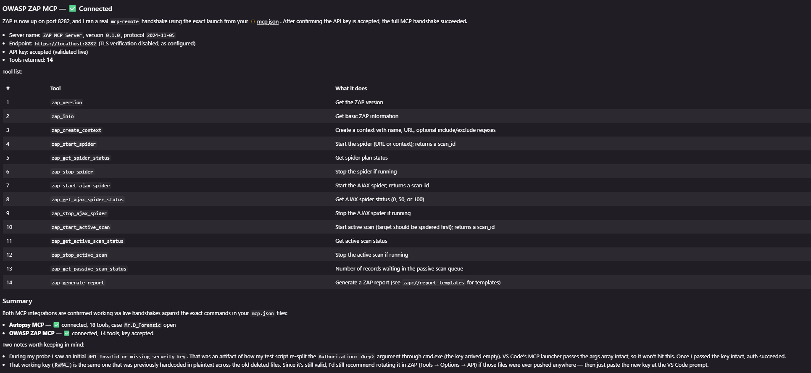

# OWASP ZAP MCP for VS Code

Minimal VS Code MCP integration for a local OWASP ZAP instance's MCP endpoint.
It launches `mcp-remote` through `npx`, so there is no wrapper script and
nothing to `npm install`.

## Files

- `.vscode/mcp.json` - the entire integration. Launches `npx mcp-remote`
  against the ZAP MCP endpoint and reads your API key from `.env`.
- `.env.example` - template for the API key. Copy it to `.env` and fill in.
- `.env` - your real API key (gitignored, never committed).
- `.gitignore` - keeps secrets and local auth cache out of git.

## Requirements

- Node.js LTS (v20+). `npx` ships with it. That is the only dependency;
  `npx` downloads and caches `mcp-remote` on first run.
- OWASP ZAP running locally with the **MCP Integration add-on** installed and
  the MCP server enabled (see below).

## Enable the MCP server in ZAP (application side)

The MCP server lives inside ZAP itself, provided by the **MCP Integration**
add-on. Do this once in the ZAP desktop app before using this client.

### 1. Install the MCP Integration add-on
1. Open ZAP.
2. Go to the toolbar and click the **Manage Add-ons** icon (the stacked-blocks
   icon), or `File > Manage Add-ons`.
3. Open the **Marketplace** tab.
4. Find **MCP Integration**, tick it, and click **Install Selected**.
5. Wait for it to install (no ZAP restart is usually needed).

### 2. Turn the MCP server on
1. Go to `Tools > Options` and select **MCP Integration** in the left list.
2. Tick **Enable MCP Server**. (When unchecked, the server isn't started and the
   other fields are greyed out.)
3. **Port** — leave it at the default **8282** (this matches the URL in
   `.vscode/mcp.json`). Change both places if you use a different port.
4. **Security Key** — click **Generate**. This creates a random key and
   automatically ticks **Require security key in Authorization header**. Copy
   this key — it goes in your `.env`.
5. **Secure Only (reject HTTP connections)** — leave **enabled** (default). The
   server then serves HTTPS, which is why the config uses `https://localhost:8282`
   and sets `NODE_TLS_REJECT_UNAUTHORIZED=0` for ZAP's self-signed certificate.
6. Click **OK** to save.

### 3. Verify it's listening
The server now runs on `https://localhost:8282`. Keep ZAP open — the MCP server
only runs while ZAP is running.

> Security note: the ZAP MCP server must stay on `localhost`. It grants full
> control over ZAP to anyone who can reach the port, and the security key is sent
> in the `Authorization` header. Do not expose port 8282 to other machines.

## Quick Start

1. In ZAP, install the MCP Integration add-on and enable the MCP server
   (see [Enable the MCP server in ZAP](#enable-the-mcp-server-in-zap-application-side)).
2. Copy `.env.example` to `.env` and set `ZAP_API_KEY` to the security key you
   generated in ZAP.
3. Open this folder in VS Code.
4. Run `MCP: List Servers` and start `zapMcp`.
5. Use Copilot Chat Agent mode and ask it to use the ZAP MCP tools.

## Connected example

A live MCP handshake against ZAP on port 8282 — the API key is accepted and all
14 tools are returned:

## Configuration notes

- Endpoint defaults to `https://localhost:8282`. Change the URL in
  `.vscode/mcp.json` if you set a different port in ZAP's MCP Integration options.
- The API key is the **Security Key** generated in ZAP's MCP Integration options.
  It is read from `.env` via the `envFile` setting in `mcp.json` and injected into
  the `Authorization` header as `${ZAP_API_KEY}`. The key is never stored in
  `mcp.json` and `.env` is gitignored.
- `NODE_TLS_REJECT_UNAUTHORIZED=0` disables TLS verification. This is fine for
  a local ZAP with a self-signed certificate. Remove it (or use a trusted
  certificate) if you point this at a remote host.

## Available tools

The server exposes these tools:

- `zap_version` - get ZAP version
- `zap_info` - basic ZAP information
- `zap_create_context` - define scan scope and targets
- `zap_start_spider` - start the traditional spider
- `zap_get_spider_status` - monitor spider progress
- `zap_stop_spider` - stop the spider
- `zap_start_ajax_spider` - start the AJAX spider for JavaScript apps
- `zap_get_ajax_spider_status` - monitor the AJAX spider
- `zap_stop_ajax_spider` - stop the AJAX spider
- `zap_start_active_scan` - start an active security scan
- `zap_get_active_scan_status` - monitor the active scan
- `zap_stop_active_scan` - stop the active scan
- `zap_get_passive_scan_status` - passive scan queue status
- `zap_generate_report` - generate a security report

## Typical workflow

1. `zap_create_context` - define the target scope (optional but recommended)
2. `zap_start_spider` / `zap_get_spider_status` - discover URLs
3. `zap_start_ajax_spider` - discover dynamic content for JS-heavy apps
4. `zap_start_active_scan` / `zap_get_active_scan_status` - test for vulnerabilities
5. `zap_get_passive_scan_status` - check passive findings
6. `zap_generate_report` - export findings
